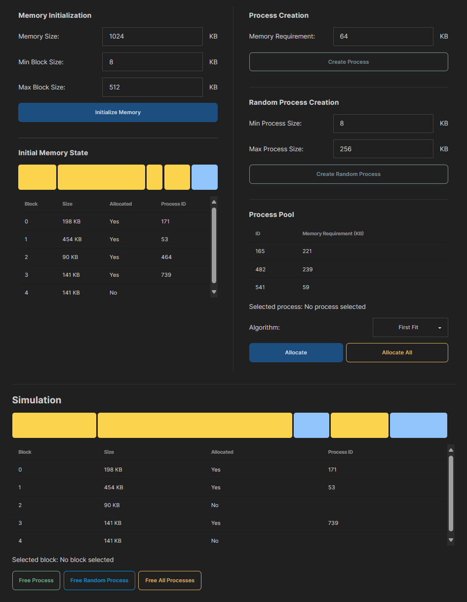

# Memory Allocation Simulator

This is a memory allocation simulator that simulates various memory allocation algorithms. The simulator is built using Python and Flask for the backend and React for the frontend.

The simulator currently supports the following memory allocation algorithms:
- First Fit
- Next Fit
- Best Fit
- Worst Fit

## Getting Started

Ensure Python and Node.js are installed on your machine.

Install the required Python packages by running this in the root directory:
```bash
pip install -r requirements.txt
```

Install the required Node.js packages by running this in the `ui` directory:
```bash
npm install
```

To start the backend server, run this in the root directory:
```bash
python app.py
```

To start the frontend server, run this in the `ui` directory:
```bash
npm run dev
```

## Screenshots

### Simulator


